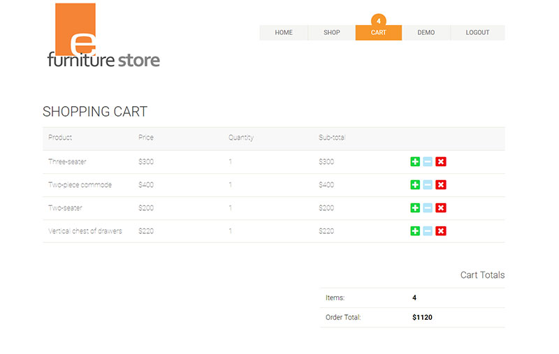

# Furniture Store

I came up with a ficticious furniture web store for my personal project. Store admin can manage store products while store visitor can browse the catalogue and fill their shopping carts.

## [Live demo](https://react-furniture-store.herokuapp.com)

## Features:
Admin
- Add new product
- Modify existing product
- Delete product
- View entire store catalogue

Visitor
- Sign up with Google account
- Add products to the shopping cart
- Change product quantity
- Remove product from the shopping cart

## Screenshots:
Shop Page:

Cart Page:

View Products Page:

